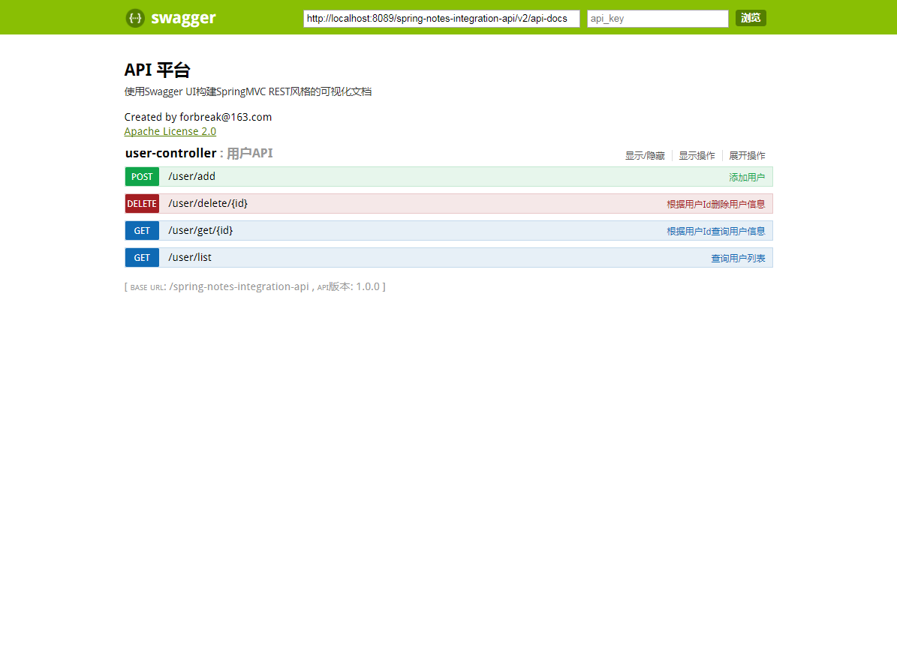

# spring-notes-integration-api

> 本项目展示如何使用 spring mvc + swagger-ui 动态生成 API 平台。

**运行方法**

```bash
$ cd spring-notes/codes/integration/api
$ mvn jetty:run -Dmaven.test.skip=true
```

运行后访问：http://localhost:8089/spring-notes-integration-api/

进入首页后，点击访问API文档，进入 API 文档页面。

**效果图**

怎么样，还不错吧！

