# Maven 快速指南

## 概念

### Maven是什么

Maven 是一个项目管理工具。它负责管理项目开发过程中的几乎所有的东西。

- **版本** maven有自己的版本定义和规则。

- **构建** maven支持许多种的应用程序类型，对于每一种支持的应用程序类型都定义好了一组构建规则和工具集。

- **输出物管理** maven可以管理项目构建的产物，并将其加入到用户库中。这个功能可以用于项目组和其他部门之间的交付行为。

- **依赖关系** maven对依赖关系的特性进行细致的分析和划分，避免开发过程中的依赖混乱和相互污染行为

- **文档和构建结果** maven的site命令支持各种文档信息的发布，包括构建过程的各种输出，javadoc，产品文档等。

- **项目关系** 一个大型的项目通常有几个小项目或者模块组成，用maven可以很方便地管理。

- **移植性管理** maven可以针对不同的开发场景，输出不同种类的输出结果。


### Maven的生命周期

maven把项目的构建划分为不同的生命周期(lifecycle)。粗略一点的话，它这个过程(phase)包括：编译、测试、打包、集成测试、验证、部署。maven中所有的执行动作(goal)都需要指明自己在这个过程中的执行位置，然后maven执行的时候，就依照过程的发展依次调用这些goal进行各种处理。

这个也是maven的一个基本调度机制。一般来说，位置稍后的过程都会依赖于之前的过程。当然，maven同样提供了配置文件，可以依照用户要求，跳过某些阶段。

### Maven的标准工程结构

Maven的标准工程结构如下：

```
|-- pom.xml(maven的核心配置文件)
|-- src
|-- main
	|-- java(java源代码目录)
	|-- resources(资源文件目录)
|-- test
    |-- java(单元测试代码目录)
|-- target(输出目录，所有的输出物都存放在这个目录下)
    |-- classes(编译后的class文件存放处)
```

### Maven的"约定优于配置"

所谓的"约定优于配置"，在maven中并不是完全不可以修改的，他们只是一些配置的默认值而已。但是除非必要，并不需要去修改那些约定内容。maven默认的文件存放结构如下：

每一个阶段的任务都知道怎么正确完成自己的工作，比如compile任务就知道从src/main/java下编译所有的java文件，并把它的输出class文件存放到target/classes中。

对maven来说，采用"约定优于配置"的策略可以减少修改配置的工作量，也可以降低学习成本，更重要的是，给项目引入了统一的规范。

### Maven的版本规范

maven使用如下几个要素来唯一定位某一个输出物：

- **groupId** 团体、组织的标识符。团体标识的约定是，它以创建这个项目的组织名称的逆向域名(reverse domain name)开头。一般对应着JAVA的包的结构。例如org.apache
- **artifactId** 单独项目的唯一标识符。比如我们的tomcat, commons等。不要在artifactId中包含点号(.)。
- **version** 一个项目的特定版本。
- **packaging** 项目的类型，默认是jar，描述了项目打包后的输出。类型为jar的项目产生一个JAR文件，类型为war的项目产生一个web应用。

maven有自己的版本规范，一般是如下定义 `<major version>`、`<minor version>`、`<incremental version>-<qualifier>` ，比如1.2.3-beta-01。要说明的是，maven自己判断版本的算法是major,minor,incremental部分用数字比 较，qualifier部分用字符串比较，所以要小心 alpha-2和alpha-15的比较关系，最好用 alpha-02的格式。

maven在版本管理时候可以使用几个特殊的字符串 SNAPSHOT，LATEST，RELEASE。比如"1.0-SNAPSHOT"。各个部分的含义和处理逻辑如下说明：

- **SNAPSHOT** 这个版本一般用于开发过程中，表示不稳定的版本。
- **LATEST** 指某个特定构件的最新发布，这个发布可能是一个发布版，也可能是一个snapshot版，具体看哪个时间最后。
- **RELEASE** 指最后一个发布版。

## 安装

### 官网下载地址

[http://maven.apache.org/download.cgi](http://maven.apache.org/download.cgi)

### 配置环境变量

> **注意：安装maven之前，必须先确保你的机器中已经安装了JDK。**

1．解压压缩包（以apache-maven-3.3.9-bin.zip为例）

2．添加环境变量MAVEN_HOME，值为apache-maven-3.3.9的安装路径

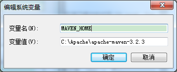

3．在Path环境变量的变量值末尾添加%MAVEN_HOME%\bin

4．在cmd输入mvn –version，如果出现maven的版本信息，说明配置成功。

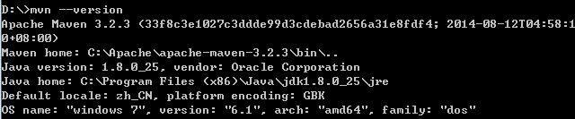

### 本地仓储配置

从中央仓库下载的jar包，都会统一存放到本地仓库中。我们需要配置本地仓库的位置。

打开maven安装目录，打开conf目录下的setting.xml文件。

可以参照下图配置本地仓储位置。

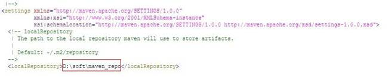

## 第一个Maven工程

### 在Eclipse中创建Maven工程

#### Maven插件

在Eclipse中创建Maven工程，需要安装Maven插件。

一般较新版本的Eclipse都会带有Maven插件，如果你的Eclipse中已经有Maven插件，可以跳过这一步骤。

点击Help -> Eclipse Marketplace，搜索maven关键字，选择安装红框对应的Maven插件。

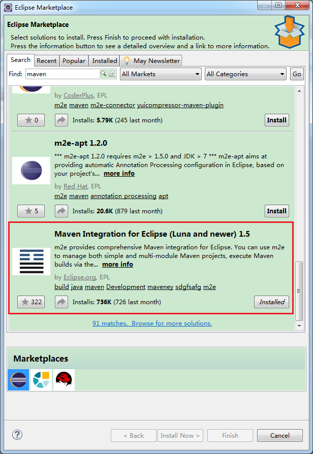

#### Maven环境配置

点击Window -> Preferences

如下图所示，配置settings.xml文件的位置

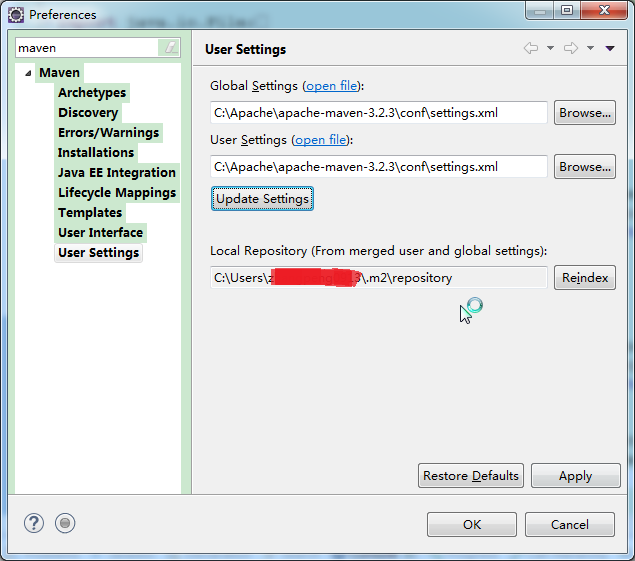

#### 创建Maven工程

File -> New -> Maven Project -> Next，在接下来的窗口中会看到一大堆的项目模板，选择合适的模板。

接下来设置项目的参数，如下：

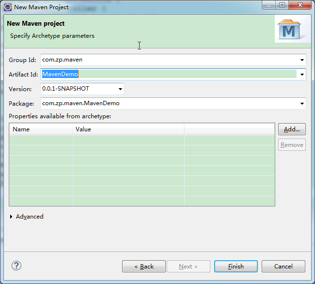

**groupId**是项目组织唯一的标识符，实际对应JAVA的包的结构，是main目录里java的目录结构。

**artifactId**就是项目的唯一的标识符，实际对应项目的名称，就是项目根目录的名称。

点击Finish，Eclipse会创建一个Maven工程。

### 使用Maven进行构建

**Eclipse中构建方式**

在Elipse项目上右击 -> Run As 就能看到很多Maven操作。这些操作和maven命令是等效的。例如Maven clean，等同于mvn clean命令。

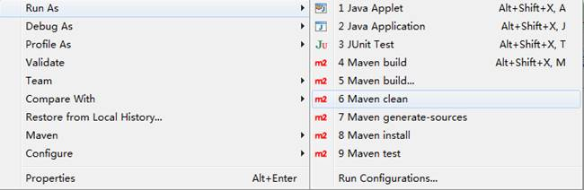

你也可以点击Maven build，输入组合命令，并保存下来。如下图：

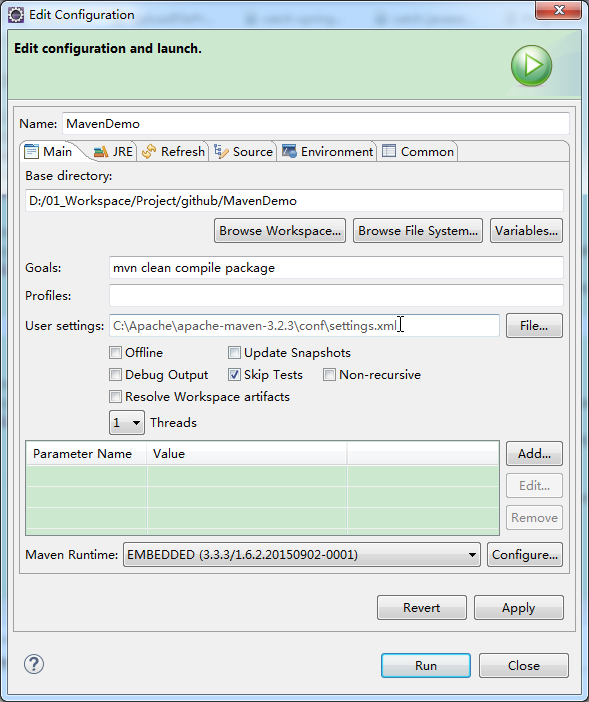

**Maven****命令构建方式**

当然，你也可以直接使用maven命令进行构建。

进入工程所在目录，输入maven命令就可以了。

如下图

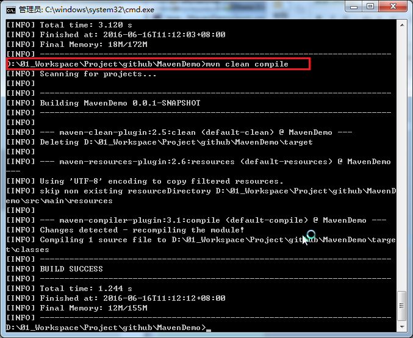

## 使用指导

### 如何添加外部依赖jar包

在Maven工程中添加依赖jar包，很简单，只要在POM文件中引入对应的`<dependency>`标签即可。

参考下例：

```xml
<project xmlns="http://maven.apache.org/POM/4.0.0"xmlns:xsi="http://www.w3.org/2001/XMLSchema-instance"
  xsi:schemaLocation="http://maven.apache.org/POM/4.0.0 http://maven.apache.org/xsd/maven-4.0.0.xsd">
  
  <modelVersion>4.0.0</modelVersion>
  <groupId>com.zp.maven</groupId>
  <artifactId>MavenDemo</artifactId>
  <version>0.0.1-SNAPSHOT</version>
  <packaging>jar</packaging>
  <name>MavenDemo</name>
  <url>http://maven.apache.org</url>
 
  <properties>
    <project.build.sourceEncoding>UTF-8</project.build.sourceEncoding>
    <junit.version>3.8.1</junit.version>
  </properties>

  <dependencies>
    <dependency>
      <groupId>junit</groupId>
      <artifactId>junit</artifactId>
      <version>${junit.version}</version>
      <scope>test</scope>
    </dependency>

    <dependency>
      <groupId>log4j</groupId>
      <artifactId>log4j</artifactId>
      <version>1.2.12</version>
      <scope>compile</scope>
    </dependency>
  </dependencies>
</project>
```

`<dependency>`标签最常用的四个属性标签：

`<groupId>`：项目组织唯一的标识符，实际对应JAVA的包的结构。

`<artifactId>`：项目唯一的标识符，实际对应项目的名称，就是项目根目录的名称。

`<version>`：jar包的版本号。可以直接填版本数字，也可以在properties标签中设置属性值。

`<scope>`：jar包的作用范围。可以填写compile、runtime、test、system和provided。用来在编译、测试等场景下选择对应的classpath。

### 如何寻找jar包

可以在 [http://mvnrepository.com/](http://mvnrepository.com/) 站点搜寻你想要的jar包版本

例如，想要使用log4j，可以找到需要的版本号，然后拷贝对应的maven标签信息，将其添加到pom .xml文件中。

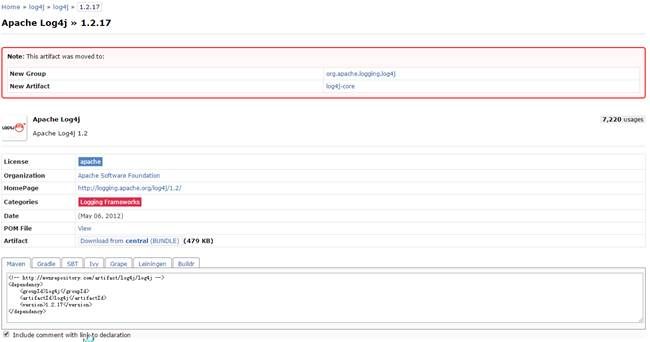

### 如何使用Maven插件(Plugin)

要添加Maven插件，可以在pom.xml文件中添加 `<plugin>` 标签。

```xml
<build>
  <plugins>
    <plugin>
      <groupId>org.apache.maven.plugins</groupId>
      <artifactId>maven-compiler-plugin</artifactId>
      <version>3.3</version>
      <configuration>
        <source>1.7</source>
        <target>1.7</target>
      </configuration>
    </plugin>
  </plugins>
</build>
```

`<configuration>` 标签用来配置插件的一些使用参数。

### 如何一次编译多个工程

在Maven中，允许一个Maven Project中有多个Maven Module

1.创建maven父工程步骤：new-->other-->选择maven project-->next-->勾选create a simple project-->next-->填写Group Id、Artifact Id、Version --> packaging选择pom-->finish。

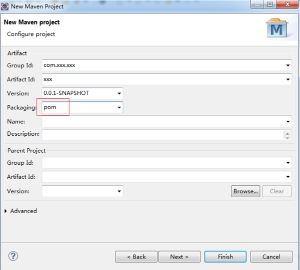

2.创建maven子工程步骤：选中刚才创建的父工程右键-->new-->other-->选择maven module-->next-->勾选create a simple project-->填写module name（其实就是artifact id）-->next-->GAV继承父工程-->packaging选择你需要的-->finish。

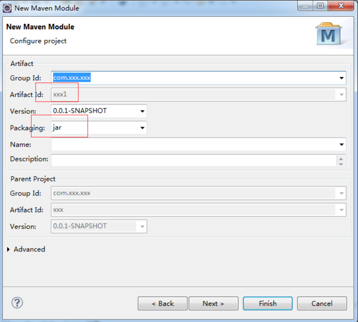

3.完成，刷新父工程；如有多个子工程，继续按照第二步骤创建。

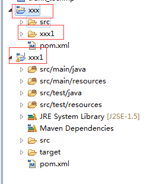

这时打开XXX中的pom.xml可以看到其中有以下标签

```xml
<modules>
  <module>xxx1</module>
</modules>
```

选择编译XXX时，会依次对它的所有Module执行相同操作。

### 常用Maven插件

#### maven-antrun-plugin

[http://maven.apache.org/plugins/maven-antrun-plugin/](http://maven.apache.org/plugins/maven-antrun-plugin/)

maven-antrun-plugin能让用户在Maven项目中运行Ant任务。用户可以直接在该插件的配置以Ant的方式编写Target， 然后交给该插件的run目标去执行。在一些由Ant往Maven迁移的项目中，该插件尤其有用。此外当你发现需要编写一些自定义程度很高的任务，同时又觉 得Maven不够灵活时，也可以以Ant的方式实现之。maven-antrun-plugin的run目标通常与生命周期绑定运行。

#### maven-archetype-plugin

[http://maven.apache.org/archetype/maven-archetype-plugin/](http://maven.apache.org/archetype/maven-archetype-plugin/)

Archtype指项目的骨架，Maven初学者最开始执行的Maven命令可能就是**mvn archetype:generate**，这实际上就是让maven-archetype-plugin生成一个很简单的项目骨架，帮助开发者快速上手。可能也有人看到一些文档写了**mvn archetype:create**， 但实际上create目标已经被弃用了，取而代之的是generate目标，该目标使用交互式的方式提示用户输入必要的信息以创建项目，体验更好。 maven-archetype-plugin还有一些其他目标帮助用户自己定义项目原型，例如你由一个产品需要交付给很多客户进行二次开发，你就可以为 他们提供一个Archtype，帮助他们快速上手。

#### maven-assembly-plugin

[http://maven.apache.org/plugins/maven-assembly-plugin/](http://maven.apache.org/plugins/maven-assembly-plugin/)

maven-assembly-plugin的用途是制作项目分发包，该分发包可能包含了项目的可执行文件、源代码、readme、平台脚本等等。 maven-assembly-plugin支持各种主流的格式如zip、tar.gz、jar和war等，具体打包哪些文件是高度可控的，例如用户可以 按文件级别的粒度、文件集级别的粒度、模块级别的粒度、以及依赖级别的粒度控制打包，此外，包含和排除配置也是支持的。maven-assembly- plugin要求用户使用一个名为`assembly.xml`的元数据文件来表述打包，它的single目标可以直接在命令行调用，也可以被绑定至生命周期。

#### maven-dependency-plugin

[http://maven.apache.org/plugins/maven-dependency-plugin/](http://maven.apache.org/plugins/maven-dependency-plugin/)

maven-dependency-plugin最大的用途是帮助分析项目依赖，**dependency:list**能够列出项目最终解析到的依赖列表，**dependency:tree**能进一步的描绘项目依赖树，**dependency:analyze**可以告诉你项目依赖潜在的问题，如果你有直接使用到的却未声明的依赖，该目标就会发出警告。maven-dependency-plugin还有很多目标帮助你操作依赖文件，例如**dependency:copy-dependencies**能将项目依赖从本地Maven仓库复制到某个特定的文件夹下面。

#### maven-enforcer-plugin

[http://maven.apache.org/plugins/maven-enforcer-plugin/](http://maven.apache.org/plugins/maven-enforcer-plugin/)

在一个稍大一点的组织或团队中，你无法保证所有成员都熟悉Maven，那他们做一些比较愚蠢的事情就会变得很正常，例如给项目引入了外部的 SNAPSHOT依赖而导致构建不稳定，使用了一个与大家不一致的Maven版本而经常抱怨构建出现诡异问题。maven-enforcer- plugin能够帮助你避免之类问题，它允许你创建一系列规则强制大家遵守，包括设定Java版本、设定Maven版本、禁止某些依赖、禁止 SNAPSHOT依赖。只要在一个父POM配置规则，然后让大家继承，当规则遭到破坏的时候，Maven就会报错。除了标准的规则之外，你还可以扩展该插 件，编写自己的规则。maven-enforcer-plugin的enforce目标负责检查规则，它默认绑定到生命周期的validate阶段。

#### maven-help-plugin

[http://maven.apache.org/plugins/maven-help-plugin/](http://maven.apache.org/plugins/maven-help-plugin/)
maven-help-plugin是一个小巧的辅助工具，最简单的**help:system**可以打印所有可用的环境变量和Java系统属性。**help:effective-pom**和**help:effective-settings**最 为有用，它们分别打印项目的有效POM和有效settings，有效POM是指合并了所有父POM（包括Super POM）后的XML，当你不确定POM的某些信息从何而来时，就可以查看有效POM。有效settings同理，特别是当你发现自己配置的 settings.xml没有生效时，就可以用**help:effective-settings**来验证。此外，maven-help-plugin的describe目标可以帮助你描述任何一个Maven插件的信息，还有all-profiles目标和active-profiles目标帮助查看项目的Profile。

#### maven-release-plugin

[http://maven.apache.org/plugins/maven-release-plugin/](http://maven.apache.org/plugins/maven-release-plugin/)

maven-release-plugin的用途是帮助自动化项目版本发布，它依赖于POM中的SCM信息。**release:prepare**用来准备版本发布，具体的工作包括检查是否有未提交代码、检查是否有SNAPSHOT依赖、升级项目的SNAPSHOT版本至RELEASE版本、为项目打标签等等。**release:perform**则 是签出标签中的RELEASE源码，构建并发布。版本发布是非常琐碎的工作，它涉及了各种检查，而且由于该工作仅仅是偶尔需要，因此手动操作很容易遗漏一 些细节，maven-release-plugin让该工作变得非常快速简便，不易出错。maven-release-plugin的各种目标通常直接在 命令行调用，因为版本发布显然不是日常构建生命周期的一部分。

#### maven-resources-plugin

[http://maven.apache.org/plugins/maven-resources-plugin/](http://maven.apache.org/plugins/maven-resources-plugin/)

为了使项目结构更为清晰，Maven区别对待Java代码文件和资源文件，maven-compiler-plugin用来编译Java代码，maven-resources-plugin则用来处理资源文件。默认的主资源文件目录是`src/main/resources`，很多用户会需要添加额外的资源文件目录，这个时候就可以通过配置maven-resources-plugin来实现。此外，资源文件过滤也是Maven的一大特性，你可以在资源文件中使用*${propertyName}*形式的Maven属性，然后配置maven-resources-plugin开启对资源文件的过滤，之后就可以针对不同环境通过命令行或者Profile传入属性的值，以实现更为灵活的构建。

#### maven-surefire-plugin

[http://maven.apache.org/plugins/maven-surefire-plugin/](http://maven.apache.org/plugins/maven-surefire-plugin/)

可能是由于历史的原因，Maven 2/3中用于执行测试的插件不是maven-test-plugin，而是maven-surefire-plugin。其实大部分时间内，只要你的测试 类遵循通用的命令约定（以Test结尾、以TestCase结尾、或者以Test开头），就几乎不用知晓该插件的存在。然而在当你想要跳过测试、排除某些 测试类、或者使用一些TestNG特性的时候，了解maven-surefire-plugin的一些配置选项就很有用了。例如 **mvn test -Dtest=FooTest** 这样一条命令的效果是仅运行FooTest测试类，这是通过控制maven-surefire-plugin的test参数实现的。

#### build-helper-maven-plugin

[http://mojo.codehaus.org/build-helper-maven-plugin/](http://mojo.codehaus.org/build-helper-maven-plugin/)

Maven默认只允许指定一个主Java代码目录和一个测试Java代码目录，虽然这其实是个应当尽量遵守的约定，但偶尔你还是会希望能够指定多个 源码目录（例如为了应对遗留项目），build-helper-maven-plugin的add-source目标就是服务于这个目的，通常它被绑定到 默认生命周期的generate-sources阶段以添加额外的源码目录。需要强调的是，这种做法还是不推荐的，因为它破坏了 Maven的约定，而且可能会遇到其他严格遵守约定的插件工具无法正确识别额外的源码目录。

build-helper-maven-plugin的另一个非常有用的目标是attach-artifact，使用该目标你可以以classifier的形式选取部分项目文件生成附属构件，并同时install到本地仓库，也可以deploy到远程仓库。

#### exec-maven-plugin

[http://mojo.codehaus.org/exec-maven-plugin/](http://mojo.codehaus.org/exec-maven-plugin/)

exec-maven-plugin很好理解，顾名思义，它能让你运行任何本地的系统程序，在某些特定情况下，运行一个Maven外部的程序可能就是最简单的问题解决方案，这就是**exec:exec**的 用途，当然，该插件还允许你配置相关的程序运行参数。除了exec目标之外，exec-maven-plugin还提供了一个java目标，该目标要求你 提供一个mainClass参数，然后它能够利用当前项目的依赖作为classpath，在同一个JVM中运行该mainClass。有时候，为了简单的 演示一个命令行Java程序，你可以在POM中配置好exec-maven-plugin的相关运行参数，然后直接在命令运行**mvn exec:java** 以查看运行效果。

#### jetty-maven-plugin

[http://wiki.eclipse.org/Jetty/Feature/Jetty_Maven_Plugin](http://wiki.eclipse.org/Jetty/Feature/Jetty_Maven_Plugin)

在进行Web开发的时候，打开浏览器对应用进行手动的测试几乎是无法避免的，这种测试方法通常就是将项目打包成war文件，然后部署到Web容器 中，再启动容器进行验证，这显然十分耗时。为了帮助开发者节省时间，jetty-maven-plugin应运而生，它完全兼容 Maven项目的目录结构，能够周期性地检查源文件，一旦发现变更后自动更新到内置的Jetty Web容器中。做一些基本配置后（例如Web应用的contextPath和自动扫描变更的时间间隔），你只要执行 **mvn jetty:run** ，然后在IDE中修改代码，代码经IDE自动编译后产生变更，再由jetty-maven-plugin侦测到后更新至Jetty容器，这时你就可以直接 测试Web页面了。需要注意的是，jetty-maven-plugin并不是宿主于Apache或Codehaus的官方插件，因此使用的时候需要额外 的配置`settings.xml`的pluginGroups元素，将org.mortbay.jetty这个pluginGroup加入。

#### versions-maven-plugin

[http://mojo.codehaus.org/versions-maven-plugin/](http://mojo.codehaus.org/versions-maven-plugin/)

很多Maven用户遇到过这样一个问题，当项目包含大量模块的时候，为他们集体更新版本就变成一件烦人的事情，到底有没有自动化工具能帮助完成这件 事情呢？（当然你可以使用sed之类的文本操作工具，不过不在本文讨论范围）答案是肯定的，versions-maven- plugin提供了很多目标帮助你管理Maven项目的各种版本信息。例如最常用的，命令 **mvn versions:set -DnewVersion=1.1-SNAPSHOT** 就能帮助你把所有模块的版本更新到1.1-SNAPSHOT。该插件还提供了其他一些很有用的目标，display-dependency- updates能告诉你项目依赖有哪些可用的更新；类似的display-plugin-updates能告诉你可用的插件更新；然后use- latest-versions能自动帮你将所有依赖升级到最新版本。最后，如果你对所做的更改满意，则可以使用 **mvn versions:commit** 提交，不满意的话也可以使用 **mvn versions:revert** 进行撤销。

更多详情请参考[https://maven.apache.org/plugins/](https://maven.apache.org/plugins/)

### 常用Maven命令

| **生命周期**                    | **阶段描述**                                 |
| --------------------------- | ---------------------------------------- |
| mvn validate                | 验证项目是否正确，以及所有为了完整构建必要的信息是否可用             |
| mvn generate-sources        | 生成所有需要包含在编译过程中的源代码                       |
| mvn process-sources         | 处理源代码，比如过滤一些值                            |
| mvn generate-resources      | 生成所有需要包含在打包过程中的资源文件                      |
| mvn process-resources       | 复制并处理资源文件至目标目录，准备打包                      |
| mvn compile                 | 编译项目的源代码                                 |
| mvn process-classes         | 后处理编译生成的文件，例如对Java类进行字节码增强（bytecode enhancement） |
| mvn generate-test-sources   | 生成所有包含在测试编译过程中的测试源码                      |
| mvn process-test-sources    | 处理测试源码，比如过滤一些值                           |
| mvn generate-test-resources | 生成测试需要的资源文件                              |
| mvn process-test-resources  | 复制并处理测试资源文件至测试目标目录                       |
| mvn test-compile            | 编译测试源码至测试目标目录                            |
| mvn test                    | 使用合适的单元测试框架运行测试。这些测试应该不需要代码被打包或发布        |
| mvn prepare-package         | 在真正的打包之前，执行一些准备打包必要的操作。这通常会产生一个包的展开的处理过的版本（将会在Maven 2.1+中实现） |
| mvn package                 | 将编译好的代码打包成可分发的格式，如JAR，WAR，或者EAR          |
| mvn pre-integration-test    | 执行一些在集成测试运行之前需要的动作。如建立集成测试需要的环境          |
| mvn integration-test        | 如果有必要的话，处理包并发布至集成测试可以运行的环境               |
| mvn post-integration-test   | 执行一些在集成测试运行之后需要的动作。如清理集成测试环境。            |
| mvn verify                  | 执行所有检查，验证包是有效的，符合质量规范                    |
| mvn install                 | 安装包至本地仓库，以备本地的其它项目作为依赖使用                 |
| mvn deploy                  | 复制最终的包至远程仓库，共享给其它开发人员和项目（通常和一次正式的发布相关）   |

**使用参数**

`-Dmaven.test.skip=true`: 跳过单元测试(eg: mcn clean package -Dmaven.test.skip=true)

## 常见问题

### dependencies和dependencyManagement，plugins和pluginManagement有什么区别？

`dependencyManagement`是表示依赖jar包的声明，即你在项目中的`dependencyManagement`下声明了依赖，maven不会加载该依赖，`dependencyManagement`声明可以被继承。

`dependencyManagement`的一个使用案例是当有父子项目的时候，父项目中可以利用`dependencyManagement`声明子项目中需要用到的依赖jar包，之后，当某个或者某几个子项目需要加载该插件的时候，就可以在子项目中`dependencies`节点只配置 groupId 和 artifactId就可以完成插件的引用。

`dependencyManagement`主要是为了统一管理插件，确保所有子项目使用的插件版本保持一致，类似的还有`plugins`和`pluginManagement`。

## 参考资料

[https://maven.apache.org/index.html](https://maven.apache.org/index.html) ——官方文档地址

[http://www.oschina.net/question/158170_29368](http://www.oschina.net/question/158170_29368)

[http://www.cnblogs.com/crazy-fox/archive/2012/02/09/2343722.html](http://www.cnblogs.com/crazy-fox/archive/2012/02/09/2343722.html)